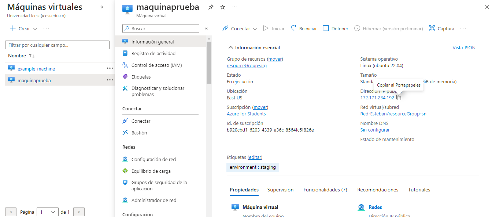
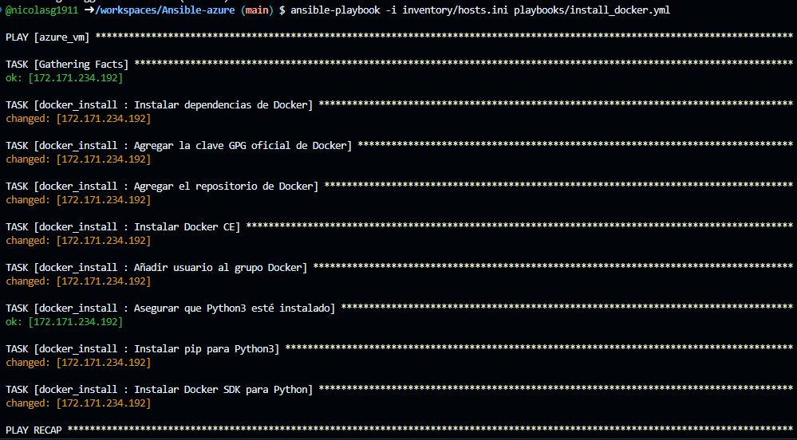
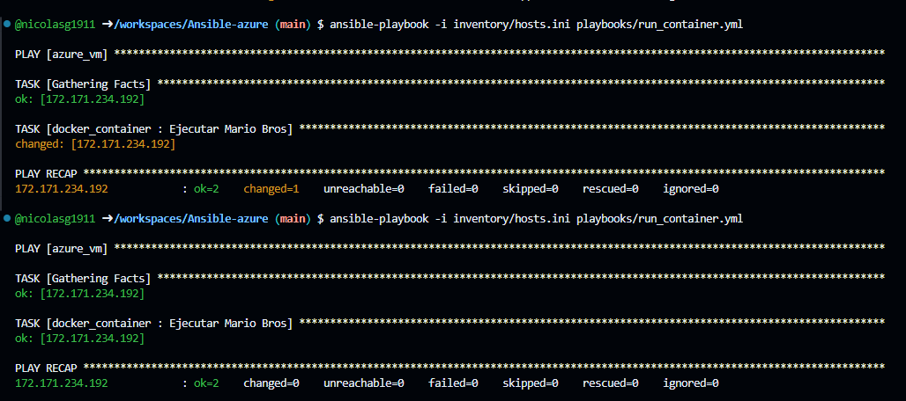

# Ansible VM
## Despliegue de la VM en Azure

### Nicolás Gómez

### Suggested technologies 
* Terraform
* Ubuntu
* Docker
* Ansible
* Azure

## VM con Terraform
<br>
Se desplegó una VM en Microsoft Azure utilizando Terraform

## Instalación de docker:
<br>
con el comando ```ansible-playbook -i inventory/hosts.ini playbooks/install_docker.yml  ``` se instaló Docker utilizando ansible

## Despliegue del contenedor:
<br>
con el comando ```ansible-playbook -i inventory/hosts.ini playbooks/run_container.yml ``` se desplegó el contenedor utilizando ansible

## Servicio desplegado:
<br>
Se muestra en la imagen, el servicio desplegado por el puerto 8088

